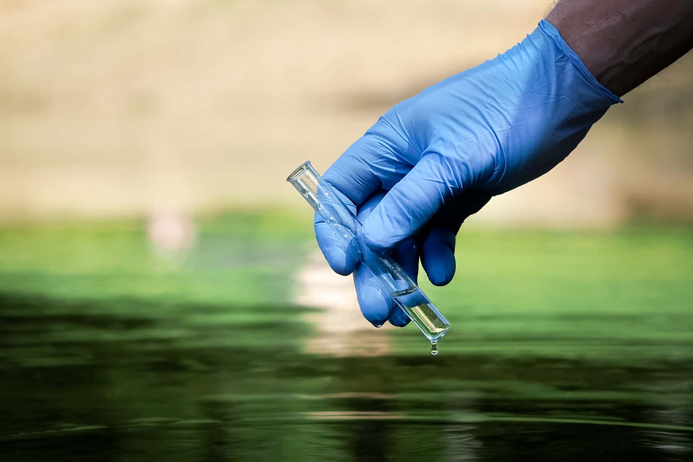

# Phase-3-Project



### Overview & Business Problem
Tanzania is a developing country that struggles with providing clean water to its population of over 57 million. While many water points are already established in the country, some are in dire need of repair.

This project was conducted for the NGO AquaRise Tanzania . AquaRise is dedicated to uplifting rural Tanzanian communities by restoring and maintaining water pumps to enhance access to safe drinking water. They collaborate with local water authorities, conduct community training on pump maintenance, and organize awareness campaigns on water conservation.

This report seeks to leverage predictive analysis to identify wells requiring repairs. If AquaRise can accurately predict the locations in need of attention, they can optimize resource allocation and develop more effective, long-term strategies.

The goal is to target wells for maintenance before they face critical issues, preventing potential water crises and ensuring sustainable access to clean water for the communities they serve.

## Data Understanding and Exploration

The data comes from two files collected from the Tanzanian Water Ministry including: 
1. Multiple independent variables with water pump ID 
2. Status of the water pump with an ID

After joining these tables, there were 39 potential independent variables that could be leveraged in the classifier. An overview of the independent variables showed that most were categorical variables -- indicating that processing would need to be done to include in the classifier.

## Running GridSearch to adjust Baseline Model 

In second model iteration, GridSearchCV was run to identify the best hyperparameters for the Decsion Tree model to fine-tune the model configuration and potentially lead to a better accuracy score. 

After running gridsearch, the best model parameters indentified were: 
1. 'criterion': 'gini',
2.  'max_depth': None,
3.  'min_samples_leaf': 2,
4.  'min_samples_split': 10

These hyperparameters produce the following results for accuracy:
- Mean Training Score: 66.36%
- Mean Test Score: 68.87%
 
Since they are both similar, there is no suggestion that these parameters would yield overfitting. However, the results are not very far from the baseline model. 


## Evaluating and Selecting the best model

All three models exhibit similar performance, with the Random Forest Model slightly outperforming the baseline and decision tree grid search models in accuracy. 

In terms of False Negatives, the Decision Tree Model demonstrates the lowest count. Given that False Negatives present a more significant concern for both the NGO and the community, <b> I have chosen the Decision Tree Model as the final choice. </b> This decision ensures a balance between accuracy and minimizing False Negatives.


## Results and Recommendations

By outputing the features importance, I identified these 4 recommedations for areas the NGO can focus it's resources: 

1. **Waterpoint Types Demand Attention:**
   Prioritize investigation and action regarding waterpoint types, especially communal standpipes, to uncover operational challenges and maintenance needs. These types exhibit higher predictive importance, suggesting that addressing issues specific to them can enhance water pump effectiveness.

2. **Renew Focus on Older Pumps:**
   Given the substantial impact of construction year on pump effectiveness, concentrate efforts on maintaining, repairing, or replacing older water pumps. This will mitigate the risks associated with aging infrastructure and ensure consistent water access.

3. **Quality Assurance for Safe Water:**
   Elevate water quality monitoring, particularly for points where the quality is currently unknown or soft. Emphasize rigorous testing and quality control measures to safeguard water safety, meeting the critical need for reliable and uncontaminated water sources.

4. **Optimize Key Extraction Techniques:**
   Optimize the functionality of water pumps that use handpumps or gravity as the method for extraction as their significance suggests their direct impact on pump efficiency. Streamline maintenance practices and periodic checks to ensure these widely used techniques operate effectively.


## Repository Structure 

```
├── README.md                           <- The top-level README for reviewers of this project
├── index.ipynb   <- Jupyter Notebook file where analysis was conducted 
├── Tanzania Water Pump Analysis.pdf         <- PDF version of project presentation
├── data   <- Sourced Externally 
├── images <- Sources Externally
```